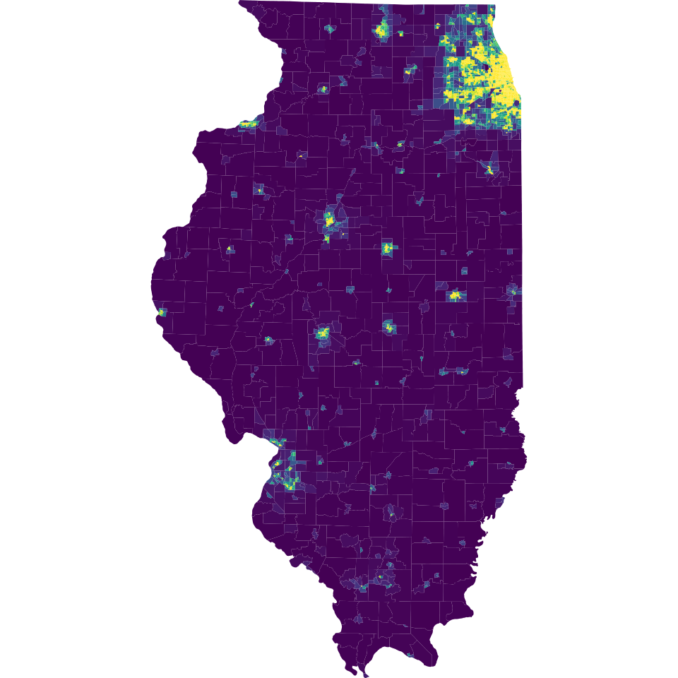

# Dataset from the American Census Bureau

## Proposal by Nardos Tessema

[The American Census Bureau](https://www.census.gov) provides a number of APIs to well curated data.

Examples:

1. [American Community Survey 1-Year Data (2011-2017)](https://www.census.gov/data/developers/data-sets/acs-1year.html)
   Areas with populations of 65,000+. Covers a broad range of topics about social, economic, demographic, and housing characteristics of the U.S. population.

2. [International Data Base (Time Series: various year - 2050)](https://www.census.gov/data/developers/data-sets/international-database.html)
   The International Data Base (IDB) offers a variety of demographic indicators for countries and areas of the world with a population of 5,000 or more.

3. [Business Dynamics Statistics (Time Series: 1976-2014)](https://www.census.gov/data/developers/data-sets/business-dynamics.html)
   An annual series tracking changes in employment, including openings, closings, startups, job creation and destruction by firm size, age, sector, state and more.

If we choose these dataset, I believe we have plenty of opportunity to make interactive visualizations. Our work will stand out because everybody in our class seems to be focusing on city data. We can do something global using the International database. Or we can go down to national or state level.

I have been trying out the mechanics of dealing with their data the past few days. Here is a coropleth map for population density of IL I generated from their data.

As another example, here is [Somthing Cool we Can Do...](https://onthemap.ces.census.gov/em/) with the data from the American Censu Bureau.